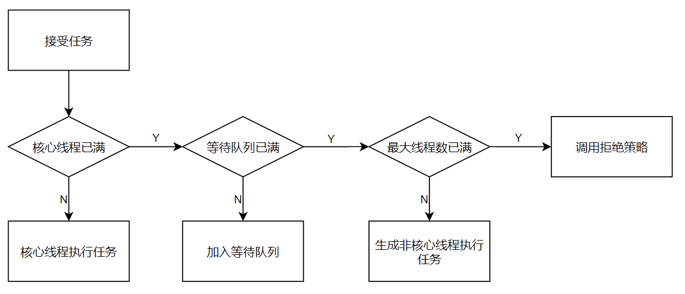

[概要](https://mp.weixin.qq.com/s?__biz=Mzk0MDE1MjM5MA==&mid=2247483661&idx=1&sn=b21937a3353f060949a8bf37d4e4aa3b&chksm=c2e74224f590cb32cd9f0af154984a77ac7b22df59ca7c9e26cddeebd0cd75a2b8042cbc6066&scene=178&cur_album_id=1541635470714044417#rd)

## 工作流程



==注意点==

- 核心线程满了是会先看等待队列的，如果是无界的等待队列就不会产生非核心线程

## 构造函数

```java

public ThreadPoolExecutor(int corePoolSize,
                          int maximumPoolSize,
                          long keepAliveTime,
                          TimeUnit unit,
                          BlockingQueue<Runnable> workQueue,
                          ThreadFactory threadFactory,
                          RejectedExecutionHandler handler) {
    if (corePoolSize < 0 ||
        maximumPoolSize <= 0 ||
        maximumPoolSize < corePoolSize ||
        keepAliveTime < 0)
        throw new IllegalArgumentException();
    if (workQueue == null || threadFactory == null || handler == null)
        throw new NullPointerException();
    this.acc = System.getSecurityManager() == null ?
            null :
            AccessController.getContext();
    this.corePoolSize = corePoolSize;
    this.maximumPoolSize = maximumPoolSize;
    this.workQueue = workQueue;
    this.keepAliveTime = unit.toNanos(keepAliveTime);
    this.threadFactory = threadFactory;
    this.handler = handler;
}
```

**1. 第一个参数 corePoolSize** 代表这个线程池的核心线程数

**2. 第二个参数 maximumPoolSize** 代表这个线程池的最大线程数 （核心线程数 +非核心线程数）

**3. 第三个参数 keepAliveTime** 代表这个线程池的非核心线程的空闲时的存活时间

**4. 第四个参数 unit** 代表这个线程池的非核心线程的空闲存活时间的单位

**5. 第五个参数 workQueue** 代表这个线程池的任务阻塞队列，jdk中有几种常见的阻塞队列

- ArrayBlockingQueue：基于数组结构的有界阻塞队列。
- LinkedBlockingQueue：是一个基于链表结构的阻塞队列。
- SynchronousQueue ：同步队列，只存储一个任务，插入任务时要等待（如果队列里有元素的话）取出任务时要等待（如果队列里没有元素的话）
- PriorityBlockingQueue：优先级队列，进入队列的元素按照优先级会进行排序

> **建议：建议使用有界队列，要是无界队列的话，任务太多的话可能会导致OOM。**

**6. 第六个参数 threadFactory（可以自定义）** 代表这个线程池的创建线程的工厂，有两种

- Executors.privilegedThreadFactory() 使用访问权限创建一个权限控制的线程。
- Executors.defaultThreadFactory() 将创建一个同线程组且默认优先级的线程

**7. 第七个参数 handler（可以自定义）** 代表这个线程池的拒绝处理任务的饱和策略，jdk默认提供了四种

- ThreadPoolExecutor.AbortPolicy()：直接抛出异常
- ThreadPoolExecutor.CallerRunsPolicy()：用当前调用者的线程中处理传过来的任务
- ThreadPoolExecutor.DiscardOldestPolicy()：丢弃最老的一个任务，然后把传过来的任务加入到阻塞队列中
- ThreadPoolExecutor.DiscardPolicy()：什么都不做，直接丢掉传过来的任务

## 注意事项

- 当核心线程和阻塞队列都满了，最大线程数没满时，就是一只造非核心线程去完成任务，可能会导致OOM
- 使用无界的阻塞队列时也可能会导致OOM


## 能否在当前项目中加入线程池？

业务场景中出现许多可以并行操作的逻辑时，就可以使用多线程。

如何判断业务完成情况？如何保证事务才是重点。

1. 遗传算法中似乎可以
   - 计算适应度时扔进线程池内
2. WMS项目中？
   - 暂无可并行处理的业务逻辑，但sql行吗？

