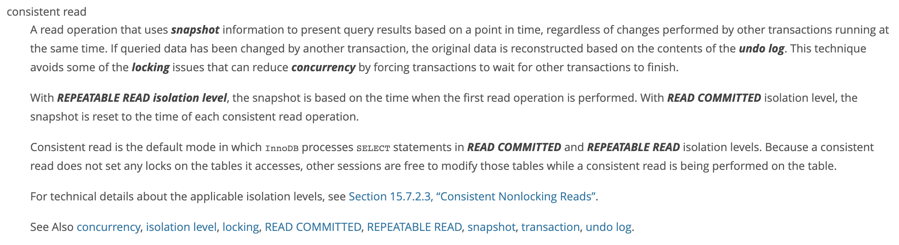

## 索引

### 种类

- 聚集索引（innoDB）
- 非聚集索引（MylSam）
- 联合索引
- 单值索引，唯一索引
- 最左匹配
- 失效

### 存储结构

- B数和B+树
- 非叶子结点的数据全都移到了叶子结点
- 非叶子结点索引冗余
- 叶子节点间的双向指针
- 提高了范围查找的能力
- 相同层数大大增加了能存放的数据数量

## 隔离级别

- 读未提交
- 读提交
  - 读数据不主动加锁但是使用了快照
  - 写数据只锁住行
- 可重复读
- 串行化

### MVCC

多版本并发控制，在每个列后面增添了当前时间和过期时间==这个不是MySql的==

- **增加了三列字段**

1. 6个字节的DB_TRX_ID：最新的插入或更新操作的事务的ID，删除被当作一种更新
2. 7个字节的DB_ROLL_PTR：指向写入回滚段的undo日志
3. 6个字节的DB_ROW_ID：自增的rowID，innoDB自动生成的聚集索引包含这个值，别的地都没有

- **undo日志**
  - 分为Insert undo和Update undo
  - insert事务提交就可以丢弃，update要确认前面没有快照要用到的时候才可以丢弃
  - update日志有版本链，指向上一个修改。insert就没有
- 在物理上，使用删除指令后不会立马删除数据行，只有丢弃了对应的undo日志才会删除对应的行及其索引记录，这个删除叫做purge。
- Read view事务启动瞬间的活跃事务会被保留，高低水位判断是否回滚生成快照
- RC和RR生成read view的时机和次数不一样
- 快照读
- 当前读

### Read View

- RC隔离级别每次读都会生成新的read view，RR级别只有第一次才会生成
- 生成的瞬间会记下4个东西：当前活跃的事务Id[m_ids ]；其中最小的Id[min_trx_id ]；最大的Id[max_trx_id ]；生成该事务的事务Id[creator_trx_id ]
- 当前活跃的就意味着还没有提交的

- 当 trx_id = creator_trx_id 时:当前事务可以看见自己所修改的数据， **可见**，

- 当 trx_id < min_trx_id 时  : 生成此数据的事务已经在生成readView前提交了， **可见**

- 当  trx_id >= max_trx_id 时  :表明生成该数据的事务是在生成ReadView后才开启的， **不可见**

- 当  min_trx_id <= trx_id < max_trx_id 时

- - trx_id 在 m_ids 列表里面 ：生成ReadView时，活跃事务还未提交，**不可见**
  - trx_id 不在 m_ids 列表里面 ：事务在生成readView前已经提交了，**可见**

### mvcc不能解决幻读

幻读：相同条件下，读和写检索出的行数不一致

RR隔离级别下的MVCC机制快照读会出现幻读，当前读由于加了间隙锁不会出现幻读

- 核心原因是RR隔离级别下，read view 读是快照读，写是当前读。当前读会加间隙锁

没提交时数据存在哪里了

两类更新丢失？

锁是什么时候上，什么时候下？