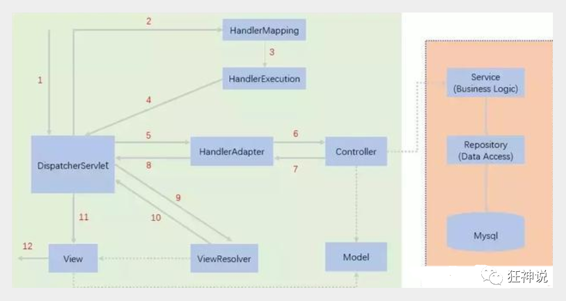

# 1、MVC

- model （pojo）

- view （jsp）

- controller （servlet）

  model one时代===>model two时代

# 2、回顾servlet

## doGet( )

1. 获取前端参数
2. 调用业务层
3. 转发或重定向
   - https://www.cnblogs.com/kingofjava/p/10761679.html
   - https://blog.csdn.net/weixin_40001125/article/details/88663468

## web.xml配置

- 配置servlet
- 可以配置session-config，超时时间等
- 可以配置欢迎页

# 3、SpringMVC

## 3.1 变化

- 在web.xml中只配置了一个dispatcherServlet，没有别的servlet了
- 项目中也没有了servlet，而是实现了Controller接口的Controller类
  - 通过ModelAndView类来实现跳转和操作参数
- 在dispatcherServlet的配置中映射了一个xml文件，在里面配置bean

## 3.2 dispatcherServlet

- 核心是doService（）方法
- 
  - 处理器映射器：找到controller
  - 处理适配器：适配controller比如行参（调用参数绑定组件）
  - 视图解析器（不能省，可以替换成别的）：转发或者重定向

## 3.3 第一个项目遇到的问题

- 404错误，是因为jar包没有导入
- 需要在artifacts里面手动加入lib

## 3.4 使用注解开发

- web.xml
- 请求方法RequestMapping
  - GetMapping
  - Post、Delete、Put

## 3.5 RestFull风格

- 使用斜杠代替？传参，方便快捷
- 使用@PathVariable注解在形参前面

## 3.6 转发和重定向和视图解析器

## 3.7 接受请求参数及数据回显

- 从前端接受的参数最好写上@RequestParam（“参数名”），更规范
- 参数名和前端传入的名字一致就可以直接用，如果是对象也可以直接用对象作为形参

## 3.8 Model和Modelmap

- 

## 3.9 乱码

- 

## 3.10 Get和Post

- Get是在tomcat配置文件里面配置了uri encoding 和拦截器无关

## 3.11 Json

- @ResponseBody，加了这个注释就只返回字符串而不是视图解析器
- @RestController=@ResponseBody+@Controller
- 导入Jackson包或者阿里的fastJson
- 配置Json乱码问题

## 3.12 拦截器

- 基于AOP的

