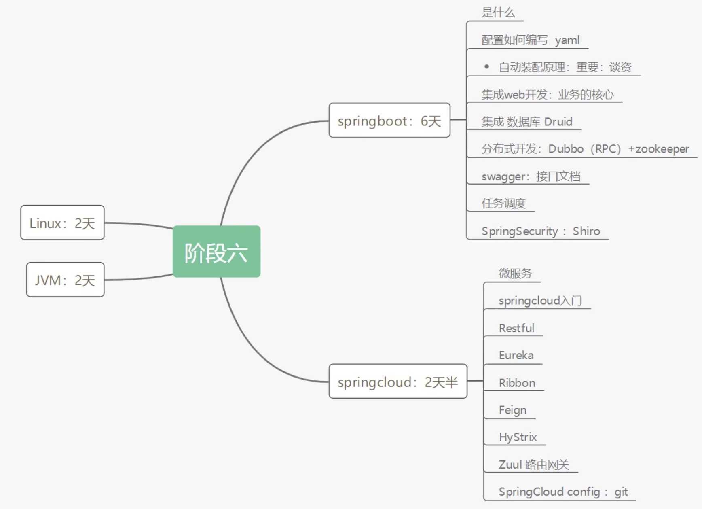
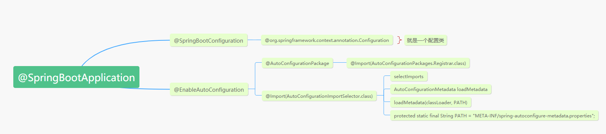

# 1、学习内容



# 2、 第一个程序

- 可以从官网下
- 也可以使用自带的inisializer，实际上也是走的官网
- banner.txt可以改启动图案

# 3、原理

- pom.xml

  - spring-boot-starter-parent：核心依赖在父工程中
  - 我们写一些依赖不用加版本就是因为 有这些版本仓库

- 启动器

  - 启动器就是Springboot的启动场景

  - ```xml
    <dependency>
        <groupId>org.springframework.boot</groupId>
        <artifactId>spring-boot-starter-web</artifactId>
    </dependency>
    ```

    比如web这个就会导入web相关的依赖

  - 要用什么功能就去找对用的启动器就行了

- **主程序【重点】**

  - @SpringbootApplication：这里面的东西要一个个点进去看

  

  - Springboot所有的自动配置都是启动的时候扫描并加载
    - spring.factories：所有的自动配置类都在这里面
    - 但是不一定生效，还要判断条件：是否导入了对应的启动器 

# 4、YAML

- 注重空格
- 不仅仅存键值对，也可以存对象和数组
- 给实体类赋值
- @ConfigurationProperties（prefix=“xxx”）
- ==占位符【SpEL】==
- 多环境spring profiles active

# 5、导入静态资源

- 可以配置spring.mvc.静态资源路径
- webjars方式可以访问到静态资源文件【不这样用】
- 源码写了有几个可以默认访问到的文件路径，其中优先级resource>static>public
- 如果配置了静态资源路径上面这些默认配置就会失效