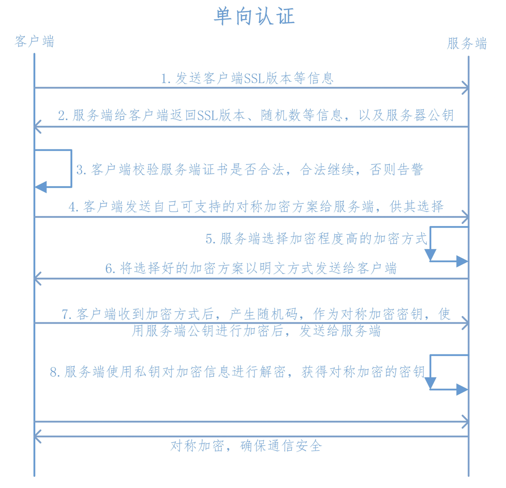

## SSL&TSL

SSL（Secure Socket Layer 安全套接层）是基于HTTP之下TCP之上的一个协议层，是基于HTTP标准并对TCP传输数据时进行加密，所以HPPTS是HTTP+SSL/TCP的简称。由于HTTPS的推出受到了很多人的欢迎，在SSL更新到3.0时，IETF对SSL3.0进行了标准化，并添加了少数机制(但是几乎和SSL3.0无差异)，标准化后的IETF更名为TLS1.0(Transport Layer Security 安全传输层协议)，可以说TLS就是SSL的新版本3.1

SSL协议位于TCP/IP协议与各种应用层协议之间，为数据通讯提供安全支持。SSL协议可分为两层： SSL记录协议（SSL Record Protocol）：它建立在可靠的传输协议（如TCP）之上，为高层协议提供数据封装、压缩、加密等基本功能的支持。 SSL握手协议（SSL Handshake Protocol）：它建立在SSL记录协议之上，用于在实际的数据传输开始前，通讯双方进行身份认证、协商加密算法、交换加密密钥等。

安全传输层协议（TLS）用于在两个通信应用程序之间提供保密性和数据完整性。该协议由两层组成： TLS 记录协议（TLS Record）和 TLS 握手协议（TLS Handshake）

## 加密

http明文传输，容易泄露信息、遭遇伪装和篡改。要保证连接双方都进行正确且安全的通信，需要对通信内容进行加密

### 对称加密

- 通信双方使用相同的共享密钥加密

- 客户端和服务端之间的共享密钥的传送问题也是一个问题，如果能够安全传送不被截获的话，那岂不是数据也可以安全的传送到不被截获？鸡生蛋蛋生鸡的问题。
- 客户端和服务端传输加密数据的时候，如果双方的共享密钥泄露的被黑客截取到的话，黑客就可以用它来解开这加密的数据，所以对称加密不安全

### 非对称加密

- 使用不相同的两组密钥进行加密和解密，其中由服务端保管的是私钥，客户端得到的是公钥。
- 这样可以保证客户端使用公钥加密后的数据不会被第三方拦截破解
- 但是服务端使用私钥加密发出的信息还是会泄露

### 混合加密

- 先使用非对称加密决定一个对称加密方式，双方再使用对称加密进行通信
- 服务端将公钥发给客户端后，客户端使用公钥加密一段信息，该信息包含了打算使用的对称加密方式。由于第三方也只有公钥，所以不能破解由公钥加密的信息，所以第三方就不知道新的对称加密方式。当双方以新的对称加密进行沟通时就能够保证安全了。
- 但是出现中间人攻击时，中间人截取第一次发给客户端的公钥，并替换成自己的公钥。之后双方的通信就都暴露了，所以客户端需要一个手段来确认第一次收到的公钥确实来自目标服务器而不是来自第三方。

### CA

- CA(证书)就是担保通信双方身份的一个方法，是建立信任链的第一步，起到的是担保职责
- 证书以证书链的形式组织，在颁发证书的时候首先要有根CA机构颁发的根证书，再由根CA机构颁发一个中级CA机构的证书，最后由中级CA机构颁发具体的SSL证书。根CA机构就是一个公司，根证书就是他的身份凭证，每个公司由不同的部门来颁发不同用途的证书，这些不同的部门就是中级CA机构，这些中级CA机构使用中级证书作为自己的身份凭证，其中有一个部门是专门颁发SSL证书，当把根证书，中级证书，以及最后申请的SSL证书连在一起就形成了证书链，也称为证书路径。在验证证书的时候，浏览器会调用系统的证书管理器接口对证书路径中的所有证书一级一级的进行验证，只有路径中所有的证书都是受信的，整个验证的结果才是受信。

### 数字签名

- 加密后的摘要

### 信息完整性

信息传输的途中，我们的信息很有可能被第三方劫持篡改，所以我们需要保证信息的完整性，通用方法是使用散列算法如SHA1，MD5将传输内容hash一次获得hash值，即摘要。客户端使用服务端的公钥对摘要和信息内容进行加密，然后传输给服务端，服务端使用私钥进行解密获得原始内容和摘要值，这时服务端使用相同的hash算法对原始内容进行hash，然后与摘要值比对，如果一致，说明信息是完整的。

- 传输内容：原文+hash算法+数字签名
- 解密方法：原文=>hash=>摘要  ？=  解密数字签名得到摘要

## https

[参考1](https://www.jianshu.com/p/031fb34a05bd)

[看这个就行了：参考2](https://www.jianshu.com/p/29e0ba31fb8d)

1. 客户端向服务端发送SSL协议版本号、加密算法种类、随机数等信息;

2. 服务端给客户端返回SSL协议版本号、加密算法种类、随机数等信息，同时也返回服务器端的证书，即公钥证书;公钥证书中包括：
   - CV私钥加密内容：服务器公钥，服务器域名
   - 服务器传输的其他内容
   - 签名

3. 客户端使用服务端返回的信息验证服务器的合法性，包括：
   - 证书是否过期;
   - 发行服务器证书的CA是否可靠;(通过查询浏览器或本机内的CA证书)
   - 通过使用本机或浏览器内置的CA公钥进行解密，得到服务器公钥及域名
   - 返回的公钥是否能正确解开返回证书中的数字签名得到解密摘要，是否是服务器签的名
   - 对内容进行相同的hash的到摘要，摘要和解密摘要相等，内容无篡改
   - 服务器证书上的域名是否和服务器的实际域名相匹配;
   - 验证通过后，将继续进行通信，否则，终止通信;
4. 客户端向服务端发送自己所能支持的对称加密方案，供服务器端进行选择;
5. 服务器端在客户端提供的加密方案中选择加密程度最高的加密方式;
6. 服务器将选择好的加密方案通过**明文**方式返回给客户端;
7. 客户端接收到服务端返回的加密方式后，使用该加密方式生成产生随机码，用作通信过程中对称加密的密钥，使用服务端返回的公钥进行加密，将加密后的随机码发送至服务器;
8. 服务器收到客户端返回的加密信息后，使用自己的私钥进行解密，获取对称加密密钥;

## 问题

1. 为什么使用明文+私钥签名而不是直接私钥加密的密文
   - 发送方使用接收方的公钥加密，可以保证消息不会泄露(只有接收方的私钥才能解密)，但因为第三方也有接收方的公钥，可以伪造消息。**不行**
   - 发送方使用自己的私钥加密，可以保证消息来自发送方，但是第三方也能看到数据。不能只发送加密的数据，接收方不知道是什么东西。**不行**
   - 明文+私钥签名，可以保证消息来自发送方，会泄露消息，但能保证消息来自发送方