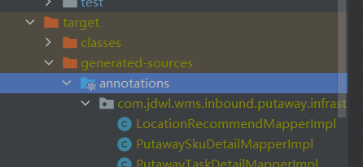

## 知识点

### mapstruct

[note]: ..\mapstruct\mapstruct-01.md

### Lombok

- @Builder：构造者模式，底层应该也是反射
  - 通过一个全参构造器和一个静态内部类来
  - 为什么要使用这个？为什么不直接用AllArgsConstructor？
  - 由于Builder会生成一个全参构造器，导致默认的无参构造器失效，所以类采用@Builder注解后无法new出来
  - 不能new出来是怎么被实例化？怎么判断要使用这个静态工厂？
  - mapstruct也会自动使用这种方法？怎么做到的？

### sql子查询

## 问题思考

### 相似的需求接口是个性化实现还是全量实现？

1. 如果设计成一个接口，根据提供的“上架类型”来执行不同的逻辑，再把数据填到Dto里面
   - 优点：
     - 只有一个Dto【全Dto】和一个api
     - 即使将来各类型的出参交集变大，也不用修改Dto
   - 缺点：
     - Dto里面有很多空字段
     - 需要额外提供一个“上架类型”字段
     - 具体逻辑还是要根据“上架类型”来走分支
     - 如果将来有新的字段需要获取还是得改Dto
2. 如果设计成多个接口：/putawayDetailQuery/xxx，每个接口一个Dto
   - 优点：
     - 直接通过xxx来走对应的分支
     - Dto里面不会有大量空字段
   - 缺点：
     - 每种上架类型都需要一个Dto（但目前三种上架明细查询出参几乎没有交集）
3. 如果新增一个需求，这两种方法分别需要做什么
   1. 根据需求调用各个方法，把需要的数据填到Dto里面；Dto越大，一般越空
   2. 根据需求调用各个方法，建一个新的Dto接收查到的数据并返回
4. 后续思考
   - 当多个需求类似，或者说有重合的部分的时候，该如何设计代码结构
   - 现在这个需求比较独特，但之后会不会出现类似的需求？
   - 需求发生变化时可能要更多关注怎么解决新增的需求

### page转换放在service层

- 如果把page转换放在repo层，那么每个查询都要写两个版本，一个分页一个不分页，或者在repo里面判断是否要分页返回，但上层的service也是要么写两个要么判断是否分页，感觉很麻烦
- 如果把page转换放在service层，就可以只在service层进行page转换

### service不应该按业务划分

- 业务是做不完的，像目前团购纸单扫描，只要验收多一点东西所有的领取任务和提交都需要改。应该按照功能划分，统一出参入参。功能可以细分，比如批量的、非批量的、操作维度不同的、操作方式不同的，但只要他们是同一个功能同一个目的，就应该有相似的部分，这部分就需要抽象出来。
- 如果出于效率考虑，量大的业务可能需要个性化的实现
- 最简单的方式就是抽象出通用的服务，如果合适，最好是用策略模式定出服务的整体框架，只局部个性化实现
- 核心还在于通用的领域实体，这样才能保证服务的通用性

### 如果有了批量的接口，是否还需要单个的接口？

- 应该要看批量和单个的执行逻辑是不是一样的。单个的逻辑可能更简洁轻便，批量的可能有额外操作。
- 如果批量只是循环单个的操作，那应该是可以去掉单个的接口

## 经验

1. 代码写完他可能编译也会出问题，有时候要手动让他编译一下

2. 设计代码，或者说实现某个需求时，要考虑扩展性，可修改性，鲁棒性
3. 