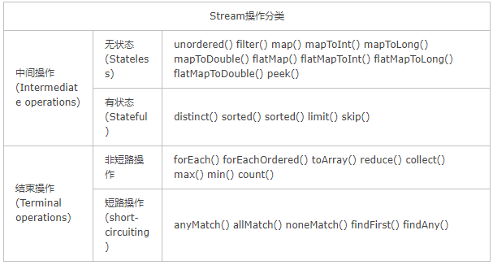

# Stream

https://blog.csdn.net/jpf254/article/details/79470986

https://www.cnblogs.com/CarpenterLee/p/6637118.html

## 函数式编程

"函数式编程"是一种"编程范式"（programming paradigm），也就是如何编写程序的方法论。它属于"结构化编程"的一种，主要思想是把运算过程尽量写成一系列嵌套的函数调用。

- 特点

  1. 函数是第一等公民（first class）

     函数与其他数据类型一样，处于平等地位，可以赋值给其他变量，也可以作为参数，传入另一个函数，或者作为别的函数的返回值。

  2. 只用表达式，不用语句

     "表达式"（expression）是一个单纯的运算过程，总是有返回值；"语句"（statement）是执行某种操作，没有返回值。函数式编程要求，只使用表达式，不使用语句。也就是说，每一步都是单纯的运算，而且都有返回值。

  3. 没有"副作用"

     所谓"副作用"（side effect），指的是函数内部与外部互动（最典型的情况，就是修改全局变量的值），产生运算以外的其他结果。函数式编程强调没有"副作用"，意味着函数要保持独立，所有功能就是返回一个新的值，没有其他行为，尤其是不得修改外部变量的值。

  4. 不修改状态

     函数式编程只是返回新的值，不修改系统变量。因此，不修改变量，也是它的一个重要特点。

  5. 引用透明

     引用透明（Referential transparency），指的是函数的运行不依赖于外部变量或"状态"，只依赖于输入的参数，任何时候只要参数相同，引用函数所得到的返回值总是相同的。

## Stream特性

1. 无储存：stream不是一种数据结构，它只是某种数据源的一个视图，数据源可以是一个数组，Java容器或I/O channel等
2. 函数式编程
3. 惰式执行==怎么做到的？==：stream上的操作并不会立即执行，只有等到用户真正需要结果的时候才会执行
4. 可消费性：stream只能被“消费”一次，一旦遍历过就会失效，就像容器的迭代器那样，想要再次遍历必须重新生成。

## 操作




distinct==源码？==

## Stream流水线解决方案🎇

1. 用户的操作如何记录？

   注意这里使用的是“操作(operation)”一词，指的是“Stream中间操作”的操作，很多Stream操作会需要一个回调函数（Lambda表达式），因此一个完整的操作是<数据来源，操作，回调函数>构成的三元组。Stream中使用Stage的概念来描述一个完整的操作，并用某种实例化后的PipelineHelper来代表Stage，将具有先后顺序的各个Stage连到一起，就构成了整个流水线。跟Stream相关类和接口的继承关系图示。

2. 操作如何叠加？

   需要有某种协议来协调相邻Stage之间的调用关系，这种协议由Sink接口完成，Sink接口包含的方法如下表所示：

   | 方法名                          | 作用                                                         |
   | ------------------------------- | ------------------------------------------------------------ |
   | void begin(Long size)           | 开始遍历元素之前调用该方法，通知Sink做好准备。               |
   | void end()                      | 所有元素遍历完成之后调用，通知Sink没有更多的元素了。         |
   | boolean cancellationRequested() | 是否可以结束操作，可以让短路操作尽早结束。                   |
   | void accept(T t)                | 遍历元素时调用，接受一个待处理元素，并对元素进行处理。Stage把自己包含的操作和回调方法封装到该方法里，前一个Stage只需要调用当前Stage.accept(T t)方法就行了。 |

   **实际上Stream API内部实现的的本质，就是如何重载Sink的这四个接口方法。**

   ```java
   // Stream.sort()方法用到的Sink实现
   class RefSortingSink<T> extends AbstractRefSortingSink<T> {
       private ArrayList<T> list;// 存放用于排序的元素
       RefSortingSink(Sink<? super T> downstream, Comparator<? super T> comparator) {
           super(downstream, comparator);
       }
       @Override
       public void begin(long size) {
           ...
           // 创建一个存放排序元素的列表
           list = (size >= 0) ? new ArrayList<T>((int) size) : new ArrayList<T>();
       }
       @Override
       public void end() {
           list.sort(comparator);// 只有元素全部接收之后才能开始排序
           downstream.begin(list.size());
           if (!cancellationWasRequested) {// 下游Sink不包含短路操作
               list.forEach(downstream::accept);// 2. 将处理结果传递给流水线下游的Sink
           }
           else {// 下游Sink包含短路操作
               for (T t : list) {// 每次都调用cancellationRequested()询问是否可以结束处理。
                   if (downstream.cancellationRequested()) break;
                   downstream.accept(t);// 2. 将处理结果传递给流水线下游的Sink
               }
           }
           downstream.end();
           list = null;
       }
       @Override
       public void accept(T t) {
           list.add(t);// 1. 使用当前Sink包装动作处理t，只是简单的将元素添加到中间列表当中
       }
   }
   ```

3. 叠加之后的操作如何执行？

   Sink完美封装了Stream每一步操作，并给出了[处理->转发]的模式来叠加操作。这一连串的齿轮已经咬合，就差最后一步拨动齿轮启动执行。是什么启动这一连串的操作呢？也许你已经想到了启动的原始动力就是结束操作(Terminal Operation)，一旦调用某个结束操作，就会触发整个流水线的执行。结束操作之后不能再有别的操作，所以结束操作不会创建新的流水线阶段(Stage)，直观的说就是流水线的链表不会在往后延伸了。**结束操作会创建一个包装了自己操作的Sink，这也是流水线中最后一个Sink**，这个Sink只需要处理数据而不需要将结果传递给下游的Sink（因为没有下游）。

4. 执行后的结果（如果有）在哪里？

   结果封装在最后一个sink里面，evaluate（xxxgetSink）.get（）

## 问题

这几个接口、抽象类和实现类分别有什么用？相互间的对应关系是什么？

# 自己实现一个Stream框架

目标是一个支持多种入参的、可以执行多种中间操作和最终操作的框架，用法上要和stream一样的pipeline操作

## Step1

1. 实现流水线操作
2. 支持String类型的入参
3. 支持filter操作
4. 终端操作是sout

- 由一个Stream接口和一个PipeLine实现类构成，接口定义行为，实现类具体实现
- PipeLine中有上下游、head标识；保存了Predicate操作
- 在accept（）方法中使用保存的Predicate方法实现过滤操作和最后的打印操作
- 在terminal（）方法中按序执行accept方法

## Step2

1. 支持多类型的入参

- 增加一个泛型就可以了，Predicate也改成那个泛型